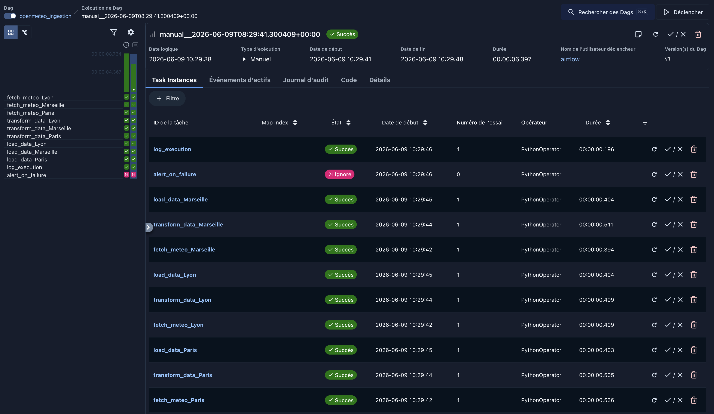

# TP3 — DAG Airflow : OpenMétéo

## Lancement de l'environnement

```bash
mkdir -p ./dags ./logs ./plugins
curl -LfO 'https://airflow.apache.org/docs/apache-airflow/stable/docker-compose.yaml'
echo -e "AIRFLOW_UID=$(id -u)" > .env
docker compose up airflow-init
docker compose up -d
```
La commande `echo -e "AIRFLOW_UID=$(id -u)" > .env`concerne les OS basés sur Unix (Linux, macOS) pour éviter des problèmes de permissions sur les volumes partagés.
Accéder à l'interface web : [http://localhost:8080](http://localhost:8080) — login `airflow` / `airflow`

## Déploiement du DAG

```bash
cp openmeteo_ingestion.py ./dags/
```

Le DAG `openmeteo_ingestion` apparaît dans l'interface web.  
Pour l'exécuter : activer le toggle puis cliquer sur **Déclancher**.

## Dépendances entre les tâches

Au sein de chaque ville, les tâches s'enchaînent séquentiellement :

```
fetch_meteo_[ville] >> transform_data_[ville] >> load_data_[ville]
```

Les trois chaînes (une par ville) sont indépendantes et s'exécutent en parallèle. En fin de pipeline, toutes les tâches alimentent `alert_on_failure` et `log_execution` :

```
[fetch, transform, load] x3 >> alert_on_failure
[fetch, transform, load] x3 >> log_execution
```

## Description des tâches

Le pipeline récupère chaque jour les données météo de 3 villes (Paris, Lyon, Marseille) via l'API Open-Meteo (gratuite, sans clé). Les 3 chaînes s'exécutent en parallèle.

| Tâche | Rôle | Trigger rule |
|---|---|---|
| `fetch_meteo_[ville]` | Appel HTTP vers l'API Open-Meteo | défaut (`all_success`) |
| `transform_data_[ville]` | Extrait les champs métier et restructure pour la table cible | défaut (`all_success`) |
| `load_data_[ville]` | Écrit les données dans `./dags/meteo_data/` | défaut (`all_success`) |
| `alert_on_failure` | Se déclenche si au moins une tâche échoue | `one_failed` |
| `log_execution` | Trace le bilan d'exécution en fin de pipeline | `all_done` |

Si `fetch_meteo_[ville]` échoue, les tâches `transform_data` et `load_data` de cette ville passent en `UPSTREAM_FAILED` et ne s'exécutent pas. `alert_on_failure` se déclenche immédiatement.

## Champs retenus pour la table cible

L'API Open-Meteo retourne de nombreux champs. On retient uniquement les 4 suivants, justifiés par le besoin métier :

| Champ API | Champ table cible | Unité | Justification |
|---|---|---|---|
| `temperature_2m` | `temperature_c` | °C | Indicateur météo principal |
| `wind_speed_10m` | `vent_kmh` | km/h | Donnée opérationnelle |
| `precipitation` | `precipitation_mm` | mm | Détection d'événements météo |
| `time` | `heure` | ISO 8601 | Clé temporelle de la table |

Les champs écartés (`interval`, `current_units`, `latitude`, `longitude`, etc.) sont soit des métadonnées API sans valeur métier, soit redondants avec les informations déjà présentes dans la table (ville, date d'exécution).

## Preuves d'exécution



## Aperçu des données produites

Fichier produit (`dags/meteo_data/Paris_2026-06-09.json`) :

```json
{
  "heure": "2026-06-09T10:15",
  "ville": "Paris",
  "vent_kmh": 14.1,
  "temperature_c": 14.7,
  "date_execution": "2026-06-09",
  "precipitation_mm": 0.0
}
```